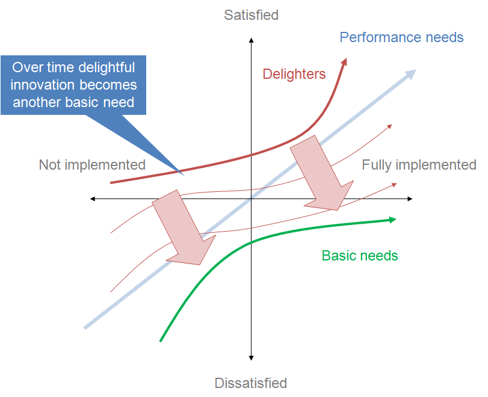

# Kano Model

_Last updated: 2025-12-16_

The Kano Model is a prioritization framework developed by Dr. Noriaki Kano in 1984 that categorizes product features based on how they impact customer satisfaction. Unlike other frameworks that focus on effort or value alone, Kano examines how customers react emotionally to each feature.

Features fall into three core categories: Must-be (basic expectations that customers assume exist), Performance (features where more is better, creating proportional satisfaction), and Attractive (delighters that create disproportionate excitement when present but don't cause dissatisfaction when absent).

For product managers, this framework reveals which features to prioritize: first ensure all Must-be features exist, then invest in Performance features that differentiate you from competitors, and finally add Attractive features that surprise and delight users.

**Feature categories:**

- **Must-be**: Basic expectations (e.g., a car has brakes)
- **Performance**: Linear satisfaction (e.g., faster load times)
- **Attractive**: Unexpected delighters (e.g., Tesla's "Ludicrous Mode")
- **Indifferent**: Features customers don't care about
- **Reverse**: Features that actually decrease satisfaction

🔗 [What is the Kano Model?](https://www.productplan.com/glossary/kano-model/)  
🔗 [Using the Kano Model to prioritize product development](https://www.mindtheproduct.com/using-the-kano-model-to-prioritize-product-development/)

