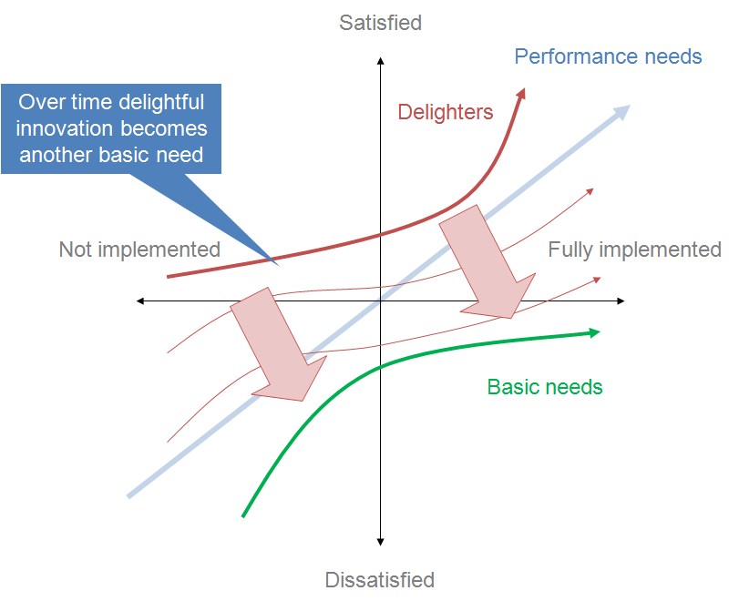

# Kano Model

_Last updated: 2025-04-13_

The Kano model originated in 1984, developed by Dr. Noriaki Kano. It is a framework for classifying and prioritising product features based on their impact on customer satisfaction.

Key elements of the Kano Model:
- Must-be (or Basic) Features: These are fundamental features that are expected by customers and, if absent, lead to dissatisfaction, but their presence alone doesn't necessarily increase satisfaction. 
- Performance Features: These features directly impact customer satisfaction, both positively and negatively, depending on their performance level. 
- Attractive Features: These features are not expected by customers and can create a positive, "delighting" experience when present, but their absence doesn't cause dissatisfaction. 
- Indifferent Features: These features have little to no impact on customer satisfaction, whether present or absent. 
- Reverse Features: These features, when present, can actually lead to dissatisfaction. 

🔗 [The Complete Guide to the Kano Model](https://foldingburritos.com/blog/kano-model/)  
🖥️ [Building a Winning UX Strategy Using the Kano Model](https://www.uie.com/kano/)

