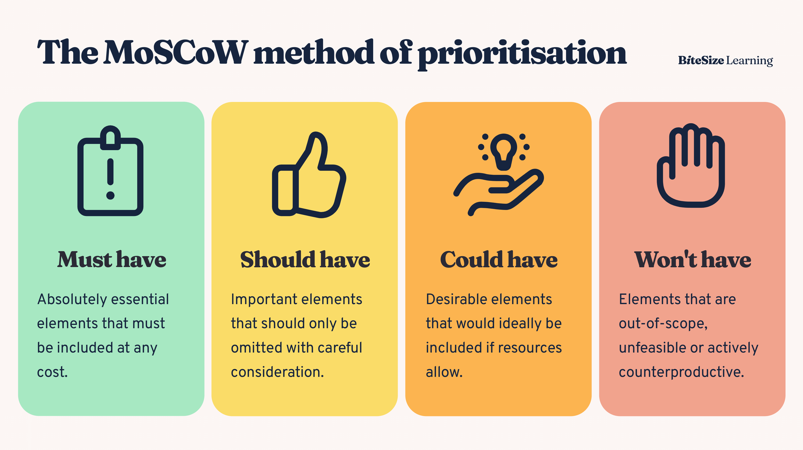

# MoSCoW Prioritization

_Last updated: 2025-12-14_

**MoSCoW** categorizes requirements into four priority levels, providing simple shared language for scope discussions and trade-off decisions.

**The Four Categories**:
1. **Must have**: Critical, non-negotiable requirements (failure if not delivered)
2. **Should have**: Important but not critical; can be deferred if necessary
3. **Could have**: Desirable enhancements; first to be deprioritized
4. **Won't have (this time)**: Explicitly excluded; prevents scope creep

**Benefits**: Simple, facilitates trade-offs, manages expectations, focuses delivery  
**Limitations**: Can be subjective; doesn't rank within categories; "Must have" inflation risk

🔗 [MoSCoW Method of Prioritization: What Is It & How It Works](https://activecollab.com/blog/project-management/moscow-method)  
🔗 [Don’t Use MoSCoW for Product Prioritisation](https://terem.tech/dont-use-moscow-for-product-prioritisation/)

