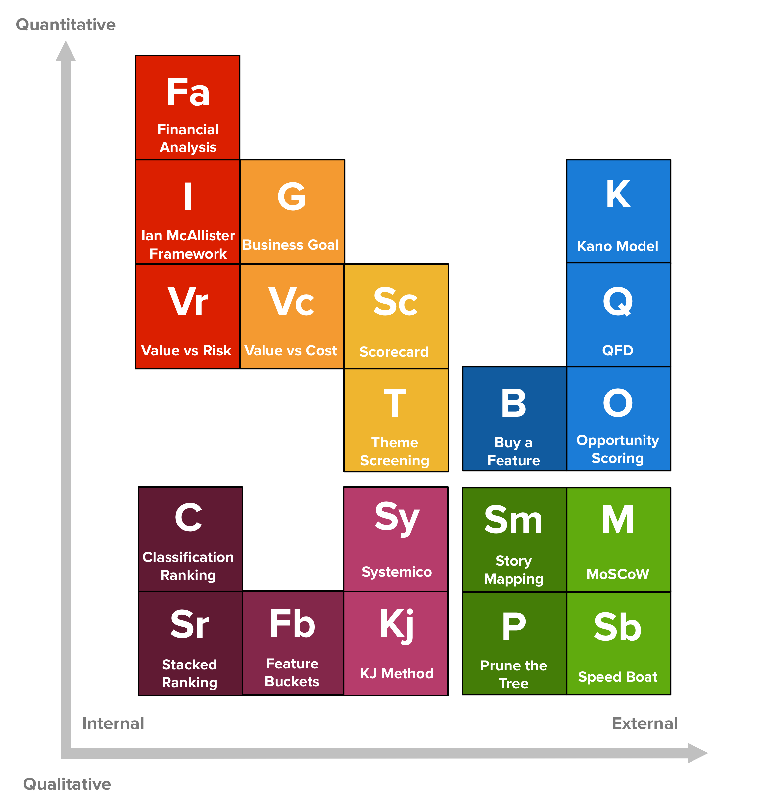

# 20 Product Prioritization Techniques

_Last updated: 2025-04-13_

You’ll find countless articles with recommendations, techniques and approaches to this very hard problem of prioritisation. However, each method’s usefulness will depend on the specific product where it’s applied. Your prioritisation needs may vary vastly. Here's a map, in the form of a Periodic Table to help you make sense of what each technique has to offer.

📄 [20 Product Prioritization Techniques: A Map and Guided Tour](https://foldingburritos.com/blog/product-prioritization-techniques/)

