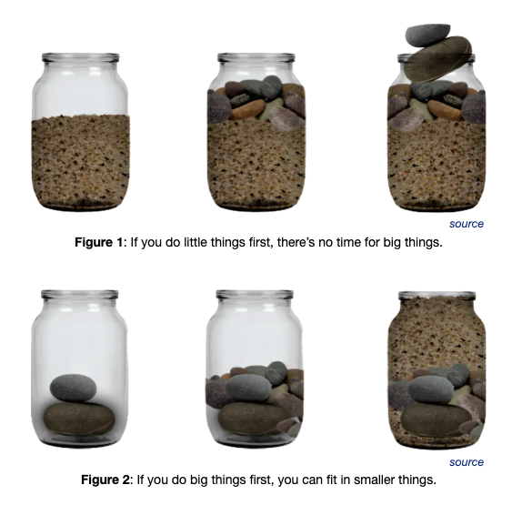

# Rocks, Pebbles, Sand

_Last updated: 2025-04-13_

This metaphor helps prioritizs and structure time by separating tasks into:
- Rocks – Big, strategic to maximise impact
- Pebbles – Mid, tactical to maximise return of investment (ROI)
- Sand – Small tasks or details to maximise throughput

Fill your schedule with rocks first to ensure long-term goals are met — the rest fills in around them.

📄 [Rocks, Pebbles, Sand: How to implement in practice](https://longform.asmartbear.com/rocks-pebbles-sand/)

