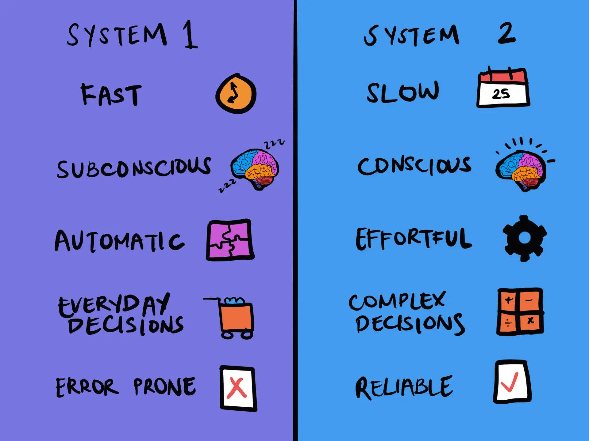

# Dual Process Theory

_Last updated: 2025-12-14_

**Dual Process Theory** popularised by Daniel Kahneman who explains that thinking operates through two systems: System 1 (fast, automatic, intuitive) and System 2 (slow, deliberate, analytical).

- **System 1**: Fast, effortless, emotional, pattern-based—prone to biases. Examples: Recognizing faces, reading text, instant judgments
- **System 2**: Slow, effortful, logical, analytical—more accurate but tiring. Examples: Math problems, product comparisons, learning new skills

🔗 [System 1 and System 2 Thinking](https://thedecisionlab.com/reference-guide/philosophy/system-1-and-system-2-thinking)  
📘 [Thinking, Fast and Slow by Daniel Kahneman](https://www.amazon.com/Thinking-Fast-Slow-Daniel-Kahneman/dp/0374533555)

