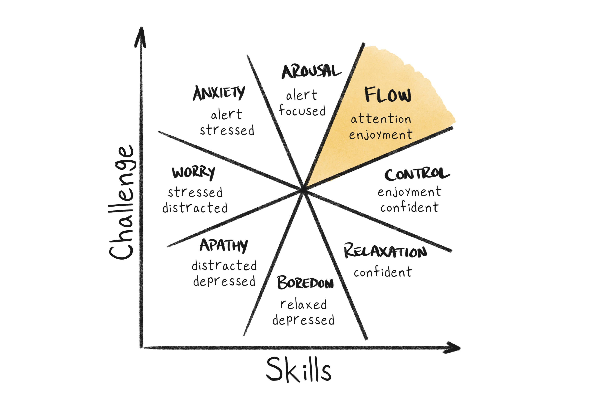

# Flow Theory

_Last updated: 2025-12-14_

**Flow Theory**, developed by Mihály Csíkszentmihályi, describes complete immersion where challenge perfectly matches skill level, creating peak performance and deep satisfaction—"being in the zone." Complete concentration, clear goals, immediate feedback, challenge-skill balance, sense of control, time distortion, intrinsic motivation. Products inducing flow see higher engagement, retention, and emotional connection.

**The Flow Channel**:
- Too difficult → Anxiety (overwhelmed)
- Too easy → Boredom (disengaged)
- Just right → Flow (fully engaged)

**Examples**: Gaming (progressive difficulty), learning platforms (adaptive lessons), productivity tools (focused modes), fitness apps (real-time metrics).

🔗 [Wikipedia: Flow (Psychology)](https://en.wikipedia.org/wiki/Flow_(psychology))  
📘 [Flow by Mihaly Csikszentmihalyi](https://www.amazon.com/Flow-Psychology-Experience-Perennial-Classics/dp/0061339202)

