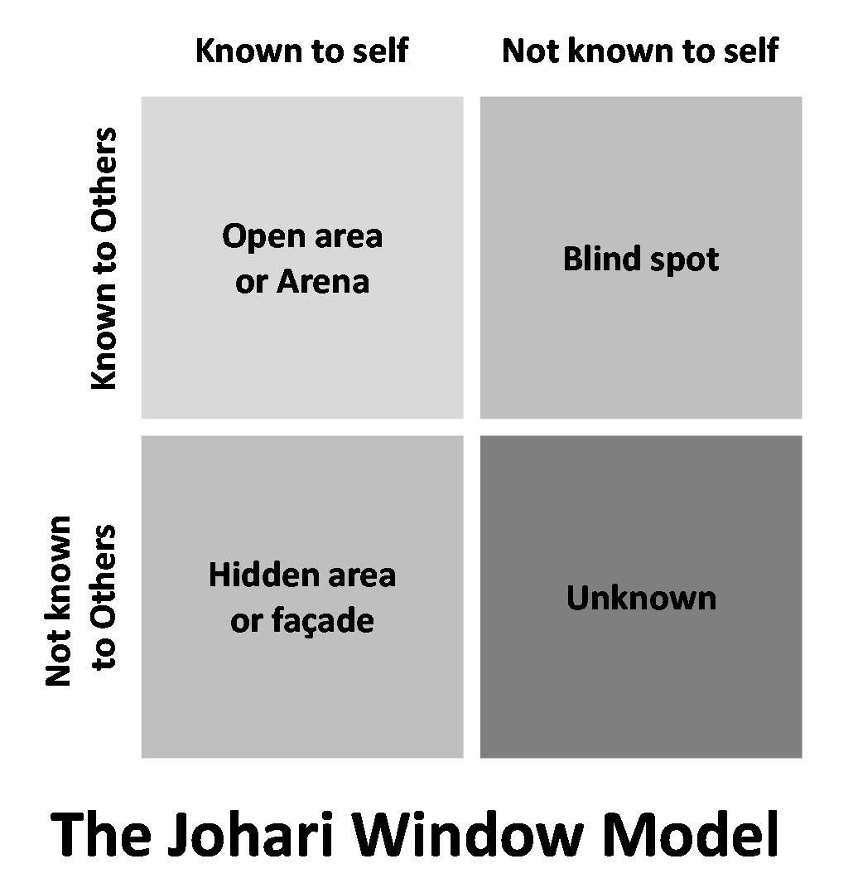

# Johari Window

_Last updated: 2025-04-13_

The Johari Window is a self-awareness and communication model developed by psychologists Joseph Luft and Harrington Ingham. It helps individuals and teams understand how they perceive themselves and how others perceive them.

The window is divided into four quadrants:
1. Open Area – Known to self and others (e.g. skills, behavior)
2. Blind Spot – Unknown to self, but known to others (e.g. quirks)
3. Hidden Area – Known to self, but hidden from others (e.g. fears)
4. Unknown Area – Unknown to both self and others (e.g. untapped potential)

It’s especially valuable in retrospectives, 360° feedback, or stakeholder alignment sessions.

📘 [Johari Window](https://en.wikipedia.org/wiki/Johari_window)

