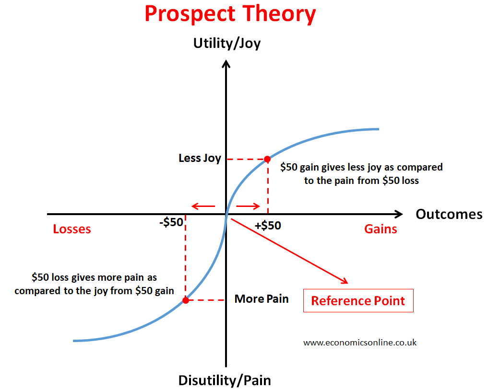

# Prospect Theory

_Last updated: 2025-12-14_

**Prospect Theory** (Kahneman & Tversky) explains how people make decisions under risk. The central insight: **losses loom larger than gains**—losing $100 hurts about 2x more than gaining $100 feels good. Understanding Prospect Theory helps PMs design persuasive experiences aligned with how humans actually make decisions.

Key principles:
- **Loss aversion**: Losses hurt approximately 2x more than equivalent gains
- **Certainty effect**: Prefer sure things over probable ones
- **Reference dependence**: Weigh probabilities differently (overweighting small, underweighting large). Decisions made relative to a reference point, not absolute values. 
- **Diminishing sensitivity**: Marginal value decreases as gains/losses grow

Product applications:
- **Pricing**: Frame discounts as "avoiding a loss" rather than "gaining a benefit"
- **Engagement**: Use loss-framed messaging ("Don't lose your progress") for retention
- **Features**: Highlight what users miss by not adopting vs. what they gain
- **Upgrades**: Frame as preventing limitations vs. adding capabilities

🔗 [Wikipedia: Prospect Theory](https://en.wikipedia.org/wiki/Prospect_theory)  
🔗 [Prospect Theory and Loss Aversion: How Users Make Decisions](https://www.nngroup.com/articles/prospect-theory/)

