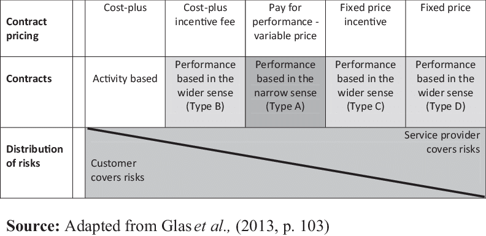

# Performance-Based Contracting

_Last updated: 2025-12-14_

Performance-based contracting is a payment model where vendors are compensated based on measurable results and outcomes rather than effort, time, or deliverables. This model aligns incentives between buyer and seller by tying payment to achieving specific performance metrics or business objectives.

In product management, this approach is commonly seen in:
- SaaS success-based pricing (pay when customers achieve value)
- Vendor partnerships with outcome-based KPIs
- Government procurement contracts
- Professional services with performance guarantees

By shifting risk to the vendor, performance-based contracting encourages accountability and ensures both parties work toward shared success metrics.

🔗 [Business Model Navigator - Performance-Based Contracting](https://businessmodelnavigator.com/pattern?id=38)   
🔗 [Performance-Based Contracting Guide](https://www.nrc.gov/docs/ML0120/ML012050418.pdf)

