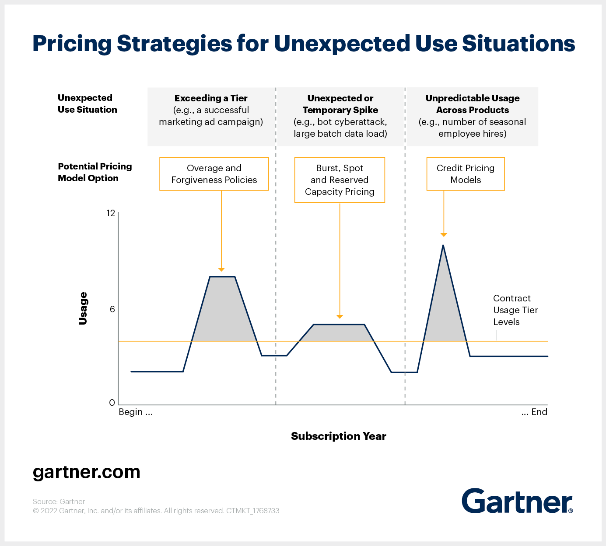

# Usage-Based Pricing

_Last updated: 2025-07-19_

Usage-based pricing or pay-per-use model charges users based on actual usage instead of a flat fee. It increases fairness and accessibility, especially for low-frequency or seasonal users.

Pros:
- Lower entry barrier
- Aligns cost with value
- Flexibility and scalability

Cons:
- Requires accurate usage tracking
- Can be complex to implement

Challenges in procurement and budgeting
- Unpredictable spending patterns
- Difficiulty in negotiating fixed costs
- The need for real-time spend monitoring

🔗 [Usage-based Pricing: What is It and How to Implement it](https://userpilot.com/blog/usage-based-pricing/)  
🔗 [How Tech Product Managers Can Inject Flexibility Into Usage-Based Pricing Strategies](https://www.gartner.com/en/articles/how-tech-product-managers-can-inject-flexibility-into-usage-based-pricing-strategies)  

