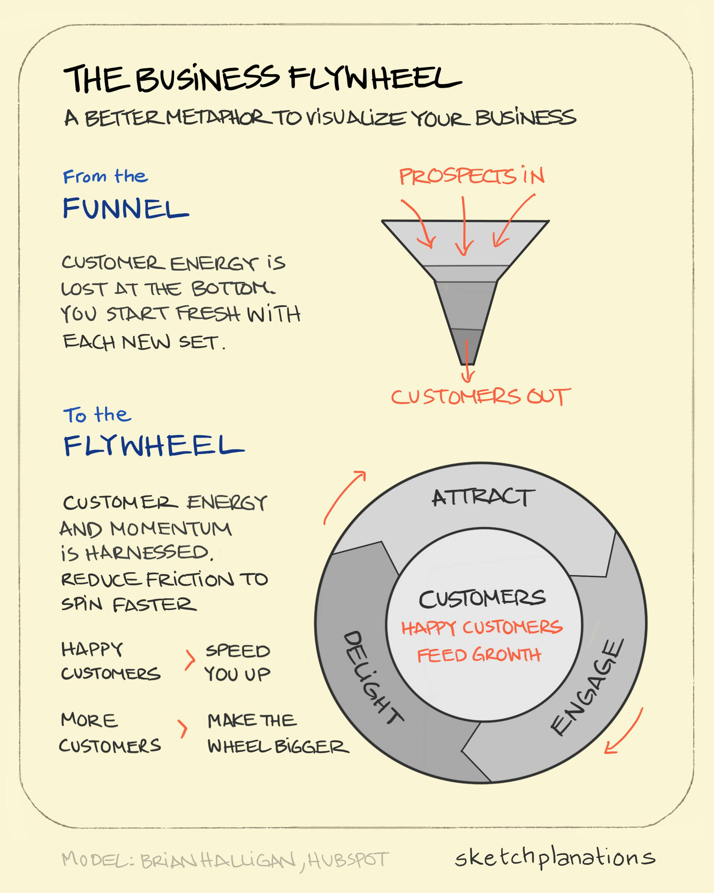

# The Business Flywheel

_Last updated: 2025-12-15_

**The Business Flywheel** is a customer-centric growth model that places satisfied customers at the center, driving momentum through their happiness and advocacy. Unlike traditional funnels that treat each marketing cycle independently, the flywheel recognizes that existing customer satisfaction creates self-sustaining growth.

Like a heavy wheel that stores and releases energy, happy customers generate momentum that attracts new customers naturally. More satisfied customers mean more stored energy, while dissatisfied ones create drag that slows the entire system.

**Key principles:**
- Reduce friction in onboarding and sharing to accelerate the wheel
- Focus on retention and word-of-mouth over constant new acquisition
- Track how customer satisfaction drives referrals and organic growth
- Identify what creates drag (poor experiences, churn points, complexity)

**Example**: Dropbox's referral program gave storage to both referrer and referee, turning satisfied users into a growth engine that accelerated their flywheel without heavy marketing spend.

📘 [Inbound Marketing by Brian Halligan & Dharmesh Shah](https://www.amazon.com/Inbound-Marketing-Revised-Updated-Customers/dp/1118896653)  
🔗 [Sketchplanations - The Business Flywheel](https://sketchplanations.com/the-business-flywheel)

