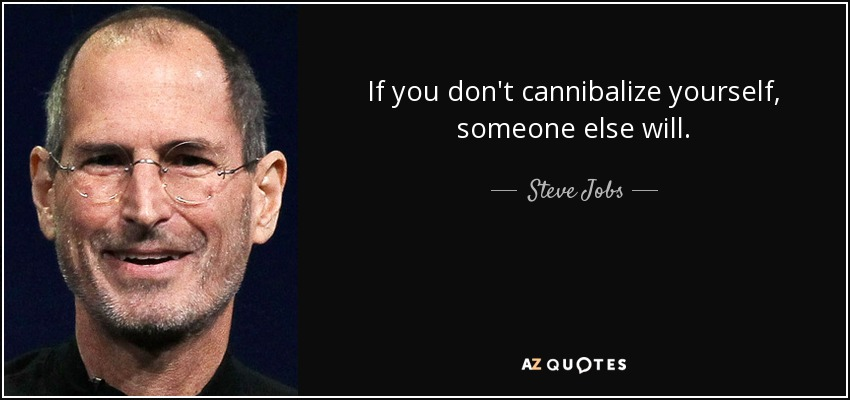

# Cannibalization

_Last updated: 2025-12-14_

**Cannibalization** occurs when a new product takes market share, revenue, or users from an existing offering within the same portfolio. While often viewed negatively, strategic cannibalization can be deliberate and necessary for evolution and leadership.

> Steve Jobs' famous quote, "If you don't cannibalize yourself, someone else will."

**When it's strategic**:
- Replacing legacy products before competitors do
- Moving customers to higher-margin or more defensible offerings
- Capturing emerging segments that would erode core business
- Accelerating innovation and maintaining leadership

**When it's problematic**:
- Net revenue or LTV decreases
- Fragmenting market without competitive advantage
- Customer confusion from overlapping products
- Internal competition vs. collaboration

**Key considerations**:
- Measure net impact on overall revenue and profitability
- Time launches to minimize disruption, maximize opportunity
- Communicate positioning and migration paths clearly
- Assess if gaining market share or redistributing customers

🔗 [The 3 Cs of Cannibalization: A Product Strategy Primer](https://medium.com/@eishaarmstrong/the-3-cs-of-cannibalization-a-product-strategy-primer-4ef14f23e923)  
🔗 [Harvard Business Review - Strategies to Fight Low-Cost Rivals](https://hbr.org/2006/12/strategies-to-fight-low-cost-rivals)  

