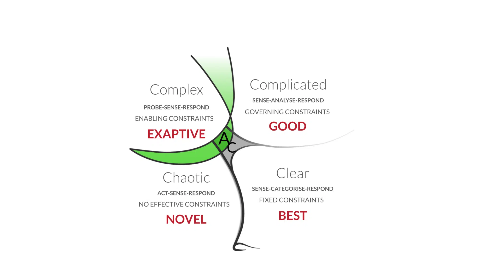

# Cynefin Framework

_Last updated: 2025-07-19_

Created by Dave Snowden, the Cynefin Framework helps leaders understand the context of problems and adapt their decision-making accordingly.

Domains:
1. Clear – Obvious cause and effect → Sense-**Categorise**-Respond
2. Complicated – Expert analysis required → Sense-**Analyse**-Respond
3. Complex – Unclear cause and effect → **Probe**–Sense–Respond
4. Chaotic – No patterns → **Act**–Sense–Respond

🔗 [The Cynefin Framework](https://thecynefin.co/about-us/about-cynefin-framework/)  
