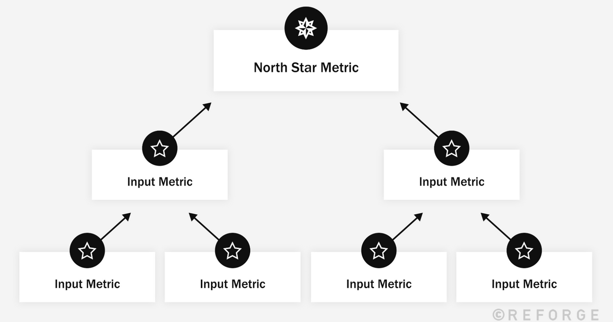

# North Star Metric

_Last updated: 2025-04-13_

The North Star Metric concept was popularised by growth hacking experts Sean Ellis and Hiten Shah. NSM is a single metric that best captures the core value your product delivers to customers. It aligns your team around a shared measure of success and drives long-term sustainable growth.

Why it matters:
- Keeps the team focused on value creation, not vanity metrics
- Encourages cross-functional alignment (Product, Marketing, Growth, etc.)
- Ties directly to customer success and retention

Your NSM should be:
- Leading indicator of long-term business success
- Measurable and actionable
- Tightly connected to user experience

Examples:
- Spotify: Time spent listening
- Airbnb: Nights booked
- Slack: Messages sent

📘 [The North Star Playbook](https://info.amplitude.com/rs/138-CDN-550/images/Amplitude-The-North-Star-Playbook.pdf)  
🔗 [How to Choose & Measure North Star Metrics: Acquisition, Retention, & Monetization](https://www.reforge.com/blog/north-star-metrics)

