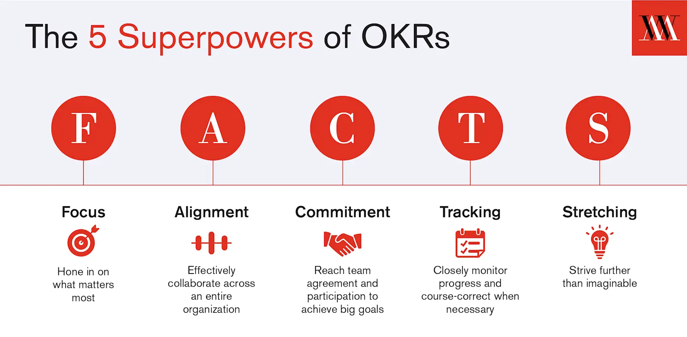

# Objectives and Key Results (OKRs)

_Last updated: 2025-07-19_

OKRs are a goal-setting framework used by teams and companies to set ambitious goals and track progress. In practice, using OKRs is different from other goal-setting techniques because of the aim to set very ambitious goals. When used this way, OKRs can enable teams to focus on the big bets and accomplish more than the team thought was possible, even if they don’t fully attain the stated goal. OKRs can help teams and individuals get outside of their comfort zones, prioritise work, and learn from both success and failure.

Format:
- Objective: Where do I want to go? (inspiring, ambitious, somewhat uncomfortable)
- Key Results: How will I pace myself to see if I am getting there? (measurable, easy to grade with a number)

🔗 [Google re:Work – Set goals with OKRs](https://rework.withgoogle.com/en/guides/set-goals-with-okrs#introduction)  
📘 [John Doerr's Measure What Matters](https://www.whatmatters.com/the-book)

