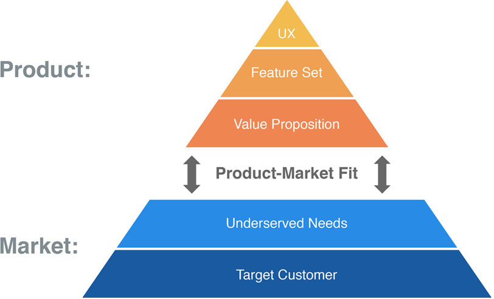

# PMF Pyramid

_Last updated: 2025-04-13_

Dan Olsen’s PMF Pyramid is a layered model for achieving product/market fit, starting from target customers up to the UX. It means finding a good market with a product capable of satisfying that market.

Each layer builds on the previous one to refine product strategy offering a step-by-step, iterative approach based on the Product/Market Fit Pyramid. This process facilitates articulating, testing, and revising key hypotheses, enhancing the product-market fit progressively.

The Lean Product Process consists of six steps:

1. Determine your target customer
2. Identify underserved customer needs
3. Define your value proposition
4. Specify your MVP feature set
5. Create your MVP prototype
6. Test your MVP with customers

📘 [The Lean Product Playbook](https://leanproductplaybook.com/)

