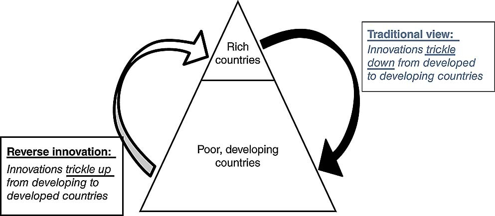

# Reverse Innovation

_Last updated: 2025-12-14_

**Reverse innovation** is popularised by Govindarajan & Trimble, where innovations developed for emerging/developing markets are adapted and adopted in developed markets, inverting the traditional "trickle-down" innovation flow (rich to poor). Reverse innovation reminds PMs that constraints breed creativity, and breakthroughs might come from overlooked markets. It's about humility and recognizing great ideas can come from anywhere.

**Key characteristics**: Born from constraints (limited resources, infrastructure, purchasing power), designed for affordability (dramatically lower price points), optimized for context (unreliable electricity, poor roads, limited expertise), unexpected global appeal.

**Examples**:
- **GE MAC 400 ECG**: Portable, battery-powered, 50% cheaper for rural India—later adopted by U.S. emergency rooms
- **Nokia low-cost phones**: Long battery, durability, multi-SIM for emerging markets—influenced rugged phone categories
- **M-Pesa**: Mobile money for Kenya with limited bank access—now influences global fintech
- **Xiaomi**: High-spec, low-price phones for China—online-only sales, flash sales, community development now standard globally

**Why it matters**: Emerging markets as innovation labs (not just expansion), constraint-driven creativity, global scalability (bottom-of-pyramid solutions scale up), sustainability alignment, competitive advantage.

**Principles**: Design from scratch (don't adapt), understand local context deeply, embrace radical affordability (10x-50x lower prices), optimize for different metrics (durability, simplicity, offline), local teams lead, plan for global scale from start.

**Challenges**: Organizational resistance ("not good enough"), cannibalization fears, different capabilities required, IP protection, quality perception.

🔗 [A Reverse-Innovation Playbook](https://hbr.org/2012/04/a-reverse-innovation-playbook)  
🔗 [Harvard Business Review - How GE is Disrupting Itself](https://hbr.org/2009/10/how-ge-is-disrupting-itself)
🔗 [Vijay Govindarajan - Reverse Innovation (book)](https://www.tuck.dartmouth.edu/people/vg/reverse-innovation)

