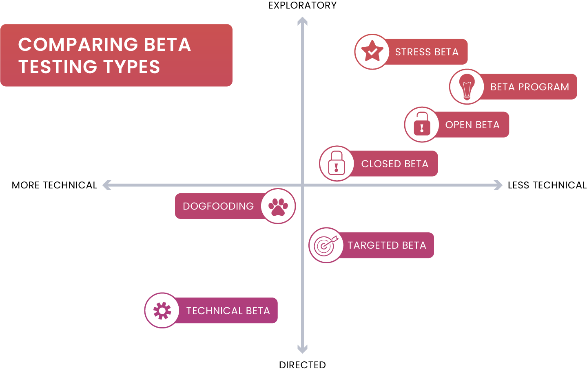

# Beta Testing

_Last updated: 2025-12-14_

**Beta testing** releases a nearly complete product to select external users to identify bugs, gather feedback, and validate under real-world conditions before official launch—the final testing stage before general availability. Beta testing validates product-market fit, refines messaging, and builds early advocates for launch.

**Types**:
- **Closed beta**: Invite-only group (early adopters, loyal customers, partners)—more control, hands-on feedback
- **Open beta**: Public access—larger volume, edge cases, stress testing

**Why it matters**:
- Real-world validation beyond controlled environments
- Usability insights from real users without training
- Performance and scalability testing
- Compatibility across devices, browsers, OS versions
- Build anticipation and early advocates
- Risk mitigation before full launch

**Best practices**: Clear objectives, right participants (target audience), defined timeline, easy feedback mechanisms (in-app tools, surveys), regular communication, incentives (early access, discounts), clear expectations, iteration loops.

**Avoid**: Starting too early with unstable product, ignoring feedback, no infrastructure for feedback scale, over-committing to all requests, failing to thank testers

🔗 [Beta testing programs: everything you need to know](https://launchdarkly.com/blog/beta-testing-programs/)  
🔗 [Beta Testing 101: A Complete Guide for Product Teams](https://www.centercode.com/guides/the-ultimate-guide-to-beta-testing)

